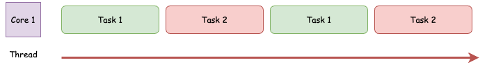
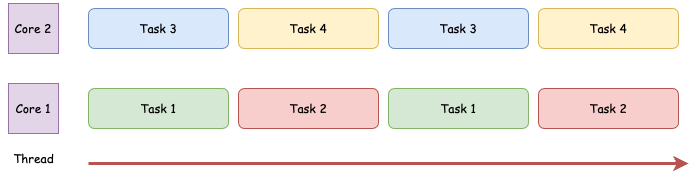
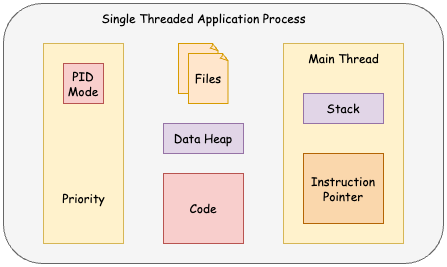
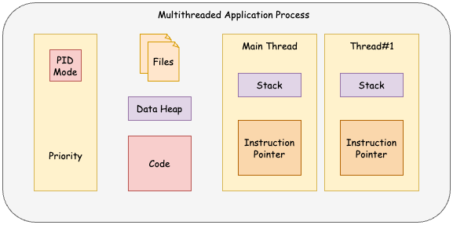

# Java Multithreading, Concurrency & Performance Optimization

## What is a thread?
A Thread is the smallest unit of execution in a process. It is a component of a process and enables parallel execution 
within that process.

## Why we need threads?
We need threads to achieve responsiveness and performance. Using techniques like Concurrency and Parallelism.

- Responsiveness is achieved by Concurrency
- Performance is achieved by Parallelism

## Concurrency
- Multiple tasks making progress
- Can occur on a single core
- Focus on task management

We don't need multiple cores to achieve concurrency. We can create an illusion of multiple tasks executing in parallel
using a single core.

## Parallelism
- Multiple tasks running simultaneously
- Requires multiple cores or processors
- Focus on execution

With multiple cores we can truly run tasks completely in parallelism.

## Processes

Operating System takes the program from hard drive and creates an instance of an application in the memory. 
That instance is called a **process**, and it's also sometimes called the **context of an application**. Each process is
completely isolated from any other process that runs on the system.

### Single Threaded Application Process
A single-threaded application process is a type of process computing where the application executes all tasks within a
single thread of execution. This means the process has only one thread running at a time to perform all its operations,
including computation, I/O, and user interactions.

### Multithreaded Application Process
A multithreaded application is a type of software that runs multiple threads of execution within a single process. Each
thread operates independently and concurrently, sharing the process's resources like files, heap and code.

**Summary:**
- Threads contains:
  - Stack
  - Instruction Pointer
- Threads share:
  - Files
  - Heap
  - Code

#### Stack
Region in memory, where local variables are stored and passed into functions.

#### Instruction Pointer
Address of the next instruction that thread is going execute.

